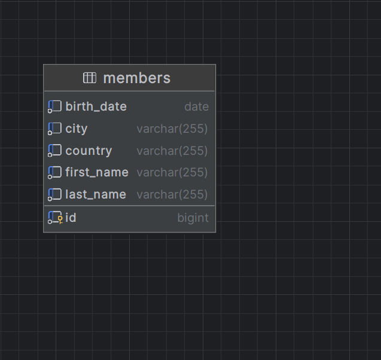

# Cake Tracker Application

## Overview

The Cake Tracker Application is designed to manage members for a birthday tracking system. It stores member information, ensures the uniqueness of each member based on specific fields( First Name, Last Name, Country, City), and provides functionality to sort members by their upcoming birthdays. The application is built using Java with PostgresSQL and Spring Boot. It uses JPA for database interactions.

## Table of Contents

- [Overview](#overview)
- [Database Schema](#database-schema)
- [Entity](#entity)
- [Repository](#repository)
- [Service](#service)
- [Controller](#controller)
- [Running the Application](#running-the-application)
- [API Endpoints](#api-endpoints)

## Database Schema

The `members` table schema is defined as follows:



- **id**: bigint, primary key, auto-generated.
- **first_name**: varchar(255), not null.
- **last_name**: varchar(255), not null.
- **birth_date**: date, not null.
- **country**: varchar(255), not null.
- **city**: varchar(255), not null.

## Entity

The `Member` entity is defined in `org.datavid.cake_tracker.entity` package. It maps to the `members` table in the database.

## Repository

The `MemberRepository` interface extends `JpaRepository` and is located in `org.datavid.cake_tracker.repository`. It offers CRUD operations and query methods for the `Member` entity.

## Service

The `MemberService` class provides the business logic for the application. It includes methods for adding a member, validating member fields, ensuring member uniqueness, validating member age, retrieving all members, and retrieving members sorted by their upcoming birthdays.

### Key Methods:

- **addMember(Member member)**: Adds a new member after validating fields, uniqueness, and age.
- **validateMemberFields(Member member)**: Ensures all mandatory fields are present and not empty.
- **validateMemberUniqueness(Member member)**: Checks if a member with the same first name, last name, country, and city already exists.
- **validateMemberAge(Member member)**: Ensures the member is at least 18 years old.
- **getAllMembers()**: Retrieves all members from the database.
- **getMembersSortedByBirthday()**: Retrieves all members sorted by their upcoming birthdays.

## Controller

The `MemberController` class handles HTTP requests and routes them to the appropriate service methods. It is located in `org.datavid.cake_tracker.controller`.

### Endpoints:

- **POST /members**: Adds a new member.
    - **Request Body**: JSON representation of a `Member` object.
    - **Response**: Success message or error message.

- **Example Requests for POST /members

### Example 1: Valid Member
This is an example of a valid member who meets all the requirements.

#### Request Body
```json
{
    "firstName": "Madalina",
    "lastName": "Puia",
    "birthDate": "1900-06-15",
    "country": "Romania",
    "city": "Bucuresti"
}

```
Response
```json
{
    "message": "Member successfully added. :) "
}
```

- **GET /members/all_members**: Retrieves all members.
  - **Response**: List of all members.

- **GET /members/sorted-by-birthday**: Retrieves members sorted by upcoming birthdays.
  - **Response**: List of members sorted by upcoming birthdays.

## Running the Application

To run the application, follow these steps:

1. **Clone the repository:**
   ```bash
   git clone https://github.com/Madalina-Tudor/CakeTrackerApplication.git
   cd CakeTrackerApplication
   ```

2. **Configure the Database**:
   - Ensure PostgreSQL is installed and running.
   - Create a database named `members`.
   - Update the `application.properties` file with your PostgreSQL database credentials.


```properties
spring.datasource.url=jdbc:postgresql://localhost:5432/members
spring.datasource.username=<your-username>
spring.datasource.password=<your-password>
spring.jpa.hibernate.ddl-auto=update
spring.jpa.show-sql=true
```

3. **Build the application**
```bash
mvn clean install
```
4. **Run the application**
```bash
mvn spring-boot:run
```
